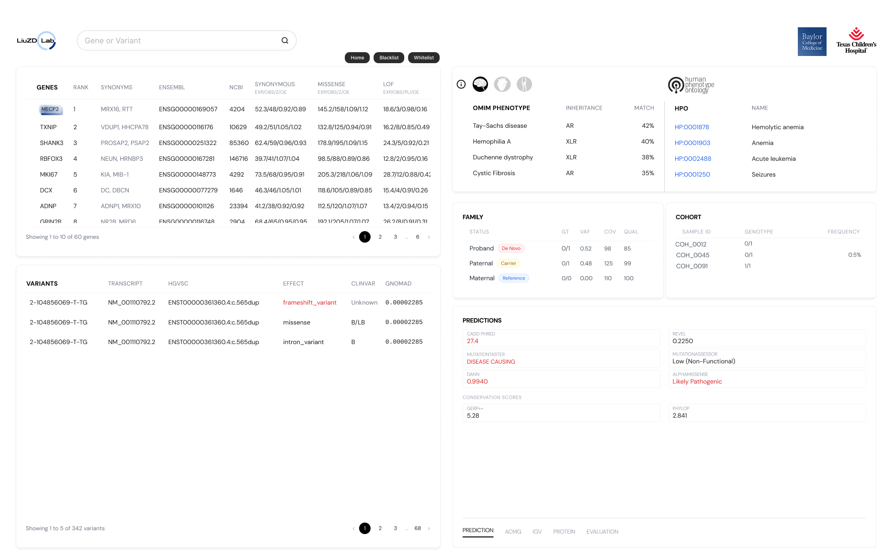

# Draft Preview

# Idea of the VariantsViewer (VV)
For the provided list of genes and variants, we wil pull and display the basic annotation information like gene id, clingen info, OMIM, gnomAD frequency and common prediction scores for the variants (like CADD, spliceAI, etc.) That said, there are two things we need frome the user before uploading their data:
  - Gene and variant predicted ranks they have,
  - Family info, VCF and BAM data, to display the variant inheritance and view sequencing data in IGV

Live demo: https://spicychicken6.github.io/VariantsViewer/

# LiuZD Lab dashboard mock

Files included:
- `index.html`
- `styles.css`
- `app.js`
- `data/*.json`
- `assets/*.svg`

Please use git system to track code change.

<!-- ## Todo:

- Polish the inheritance determining logic in [inheritance.py](/home/yuzhijian/work_dir/VariantsViewer/functions/inheritance.py), especially around edge cases, genotype normalization breadth, Mendelian-error labeling, and future backend integration. 

-->

# Fonts

- **Logo:** Zen Dots (400) — used exclusively for the "LiuZD Lab" brand logo
- **Body / UI:** Roboto (400, 500, 700) — used for all general text, labels, headings, and table content
- **Monospace / Data:** Roboto Mono (400, 500, 700) — used for genomic IDs, variant coordinates, and numeric data (`.mono` class)
- **Pagination / Selection Buttons:** DM Sans (400, 500, 700) — bundled locally in `assets/fonts/` and used for pagination numbers plus prediction-panel selection buttons such as `PREDICTION` and `ACMG`
- Fonts are loaded from `assets/fonts/fonts.css` in `index.html`
- Defined as CSS custom properties in `styles.css` for easy switching:
  - `--font-body` — body font stack
  - `--font-mono` — monospace font stack
  - `--font-pagination` — pagination UI font stack

# Design guidelines

- Use font sets for text, turn it into parameter settings so all text fonts can be switched easily. Use different fonts for texts of different sections or components.
- Try to keep code clean. Remove unused code or try to reuse functions to reduce the redundant code.
- Always make sure the website can dynamically adapt to different viewing size.
- The final product will have to quickly search in data files of size larger than 1GB. Make sure there is a good python backend part that can process data loading and filtering efficiently.

# Unified Color Use

- Use `#f4f5f7` as the shared neutral gray for phenotype-side shading and selection surfaces.
- Current uses include:
  - OMIM phenotype row hover state
  - OMIM phenotype selected row state
  - HPO table shaded container background
  - HPO table header background
- Prefer reusing this same gray for future neutral phenotype/HPO highlight treatments instead of introducing nearby one-off grays.

# Inheritance Rules

- Trio inheritance logic is now implemented in [inheritance.py](/home/yuzhijian/work_dir/VariantsViewer/functions/inheritance.py).
- The Python module includes:
  - `INHERITANCE_RULES`
  - `normalize_gt(gt)`
  - `is_par_region(chrom, pos)`
  - `determine_inheritance(chrom, pos, proband_sex, proband_gt, mat_gt, pat_gt)`
- The script also includes a `pandas` example under `if __name__ == "__main__":` for row-wise DataFrame usage.

# Test 

- Different sections of the webpage load different data files. Always test loading data to make sure everything works.
- Test all the logo links work
